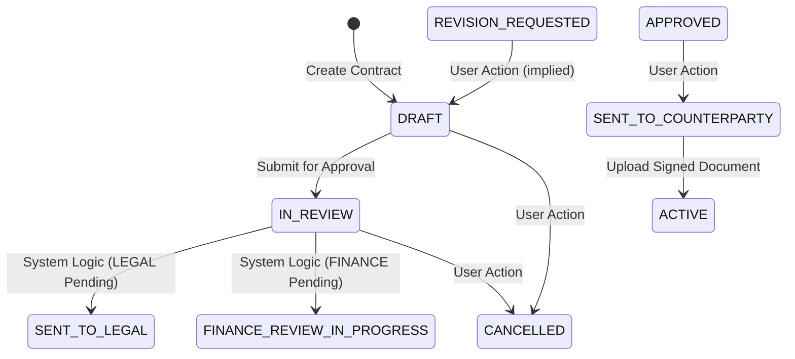
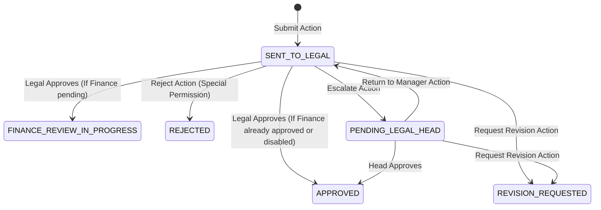
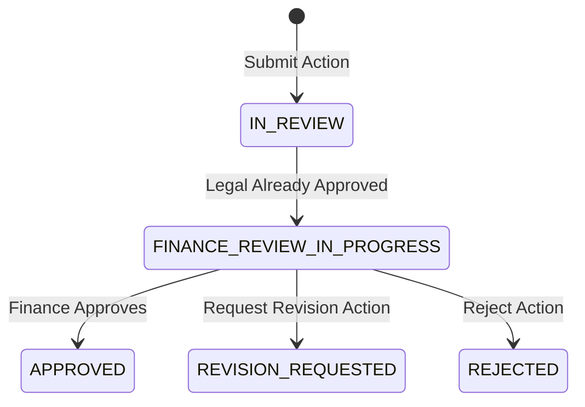

# CLM Implementation: Status Transition Flow Diagrams

This document outlines the **actual status transition logic** as implemented in the current codebase (specifically `ApprovalsService` and `ContractWorkflowService`), which differs slightly from the initial PRD.

## 1. Business User Implementation Flow
The Business User manages the creation and submission of contracts.

---

## 2. Legal Review Implementation Flow (Manager & Head)
Legal moves from `IN_REVIEW` to `SENT_TO_LEGAL` and can escalate to the Head.

---

## 3. Finance Review Implementation Flow
Finance review typically follows or runs parallel to Legal review.

---

## 4. The "Gatekeeper" Logic (Backend)
The `ApprovalsService` uses a specific priority to determine the contract status when any approval is processed:

1.  **Priority 1**: If **LEGAL** is still `PENDING` -> Status is **`SENT_TO_LEGAL`**.
2.  **Priority 2**: If **FINANCE** is still `PENDING` -> Status is **`FINANCE_REVIEW_IN_PROGRESS`**.
3.  **Completion**: If all required approvals are `APPROVED` -> Status is **`APPROVED`**.

---

## Code vs PRD Discrepancies

| Feature | PRD Specification | Code Implementation |
|---------|-------------------|---------------------|
| **Submit Entry State** | `SENT_TO_LEGAL` | `IN_REVIEW` |
| **Escalation State** | `ESCALATED_TO_HEAD` | `PENDING_LEGAL_HEAD` |
| **Finance State** | Parallel Track (No blocking) | Serial Logic (`FINANCE_REVIEW_IN_PROGRESS` follows Legal) |
| **Rejection** | "No rejection button" | Hard `REJECTED` state and button exists |
| **Cancellation** | Not explicitly mentioned in flow | `CANCELLED` status exists and is available |

> [!NOTE]
> The codebase implements a more rigid state machine than the PRD implies, especially regarding the priority of Legal over Finance review in the displayed status.
