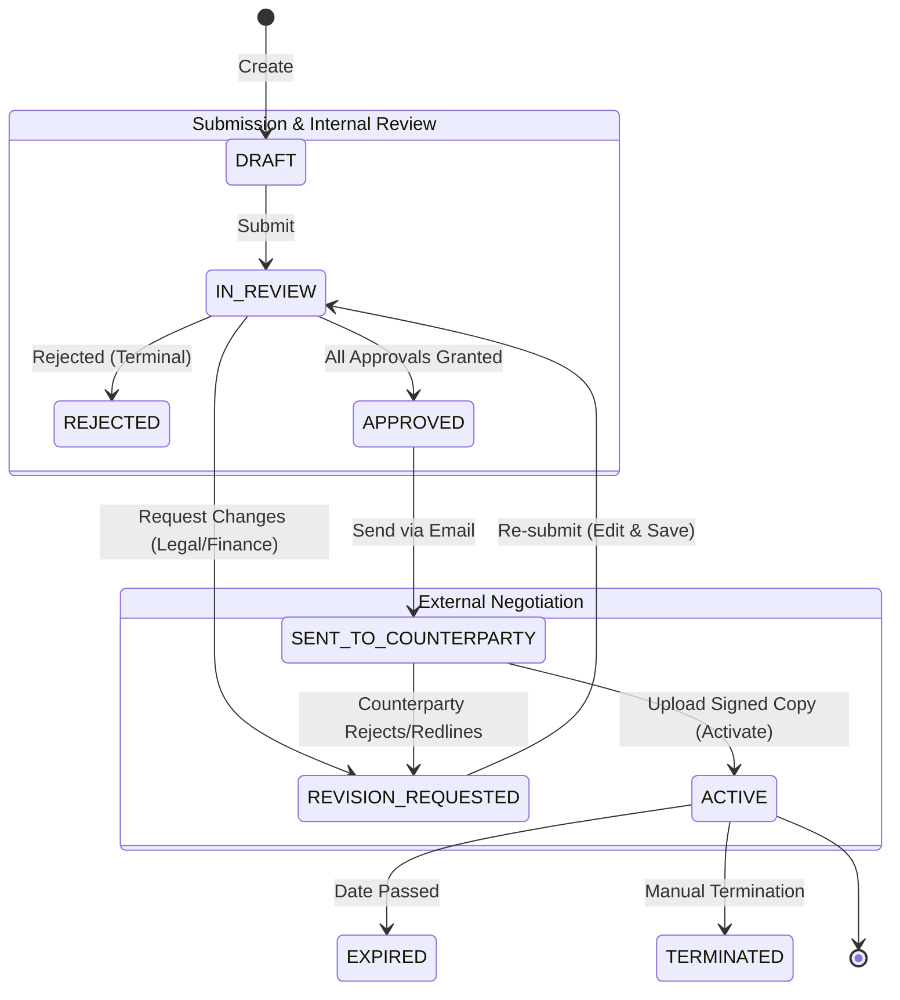
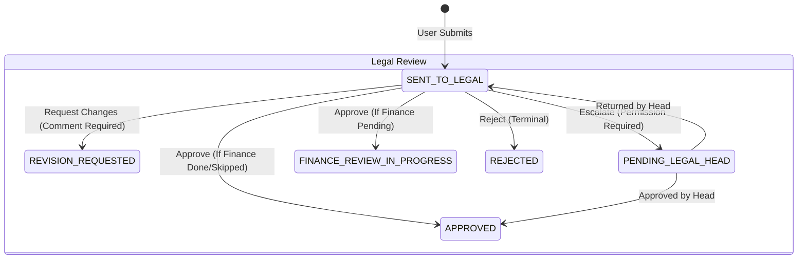
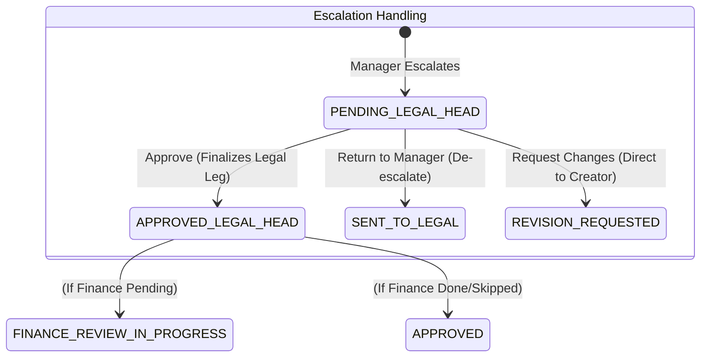
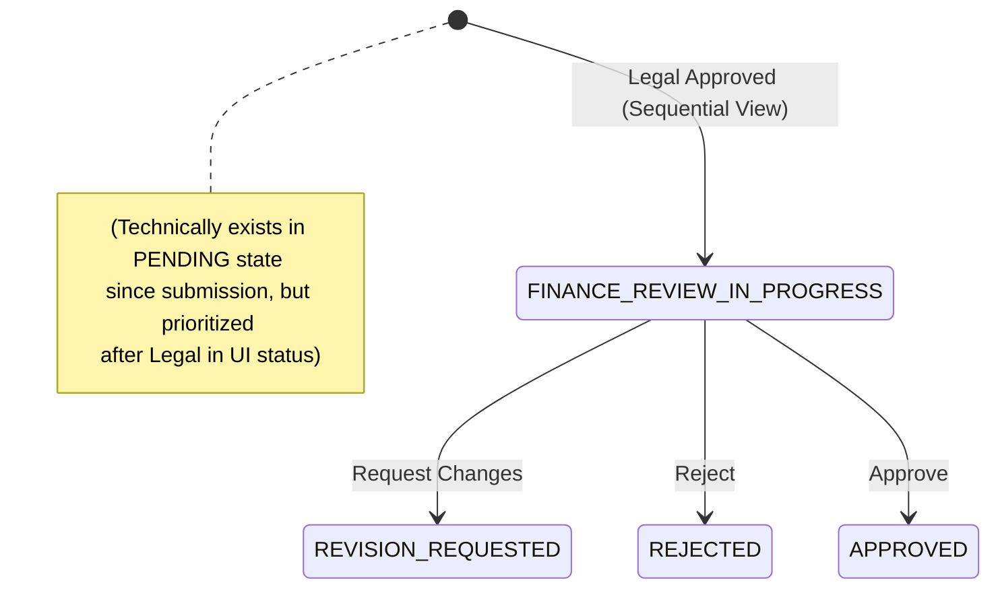
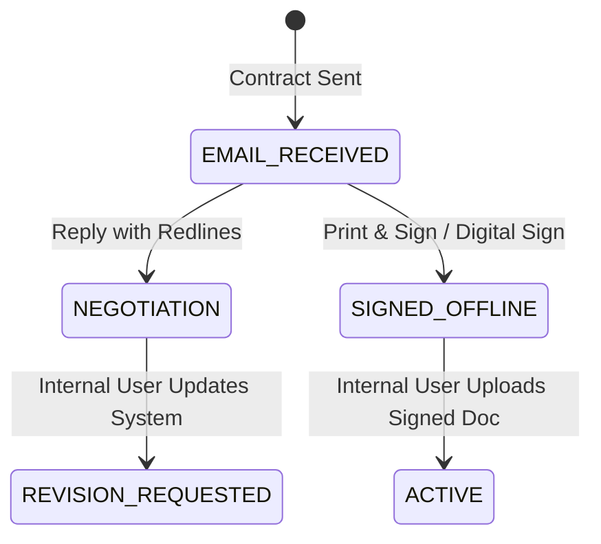

# CLM User Role Status Flows & Logic

This document details the exact status transition logic for the CLM platform, derived from the current backend implementation (`ApprovalsService`, `ContractWorkflowService`) and database schema.

## Core logic
- **Approvals**: Generated in **PARALLEL** (Legal + Finance) upon submission.
- **Contract Status**: Reflects a **SEQUENTIAL PRIORITY** for clarity:
  1. If Legal is pending -> `SENT_TO_LEGAL`
  2. If Legal done, but Finance pending -> `FINANCE_REVIEW_IN_PROGRESS`
  3. If both done -> `APPROVED`
- **Gatekeeping**: A contract **cannot** be sent to a counterparty until it reaches the `APPROVED` state (implying all required approvals are granted).

---

## 1. Business User (Creator) Flow
**Goal**: Draft, Submit, Negotiate, and Execute contracts.

**Key Actions:**
- `Submit`: Moves from `DRAFT` to `IN_REVIEW`.
- `Edit`: Allowed in `DRAFT` or `REVISION_REQUESTED`.
- `Upload Signed`: Moves from `SENT_TO_COUNTERPARTY` to `ACTIVE`.

---

## 2. Legal Approver (Manager) Flow
**Goal**: Review compliance, request changes, or escalate.

**Logic Detail:**
- **Approve**: Sets Legal Approval = `APPROVED`.
  - *Effect*: If Finance is pending, Contract Status becomes `FINANCE_REVIEW_IN_PROGRESS`. Else, `APPROVED`.
- **Request Revision**: Sets Contract Status = `REVISION_REQUESTED`.
- **Escalate**: Sets Contract Status = `PENDING_LEGAL_HEAD`.

---

## 3. Legal Head Flow
**Goal**: Handle escalated complex contracts.

**Key Actions:**
- **Return to Manager**: Sends the ticket back to the escalating Legal Manager's queue (`SENT_TO_LEGAL`).
- **Approve**: Overrides the Manager's approval and completes the Legal requirement.

---

## 4. Finance Approver Flow
**Goal**: Commercial/Financial validation.

**Logic Detail:**
- **Visibility**: Finance *can* see contracts in `SENT_TO_LEGAL`, but their "Turn" is officially emphasized when status is `FINANCE_REVIEW_IN_PROGRESS`.
- **Approve**: Sets Finance Approval = `APPROVED`.
  - *Effect*: If Legal is already done (usual case in this flow), Contract Status becomes `APPROVED`.

---

## 5. Counterparty (External) Flow
**Goal**: Review, Sign, or Redline.

---

## 6. System Status Mapping Table

| Contract Status | System State Meaning | Who Can Act? |
| :--- | :--- | :--- |
| **DRAFT** | Created, not submitted. | Creator |
| **SENT_TO_LEGAL** | Legal Approval is PENDING. | Legal Manager |
| **PENDING_LEGAL_HEAD** | Escalated by Manager. | Legal Head |
| **FINANCE_REVIEW_IN_PROGRESS** | Legal DONE, Finance PENDING. | Finance Team |
| **REVISION_REQUESTED** | Reverted by any approver. | Creator (Edit) |
| **APPROVED** | All internal approvals done. Ready to send. | Creator |
| **SENT_TO_COUNTERPARTY** | Emailed to vendor/client. | Counterparty (Offline) / Creator |
| **ACTIVE** | Signed document uploaded. | System / Admin |
| **REJECTED** | Hard rejection. Terminal state. | None (Read Only) |

