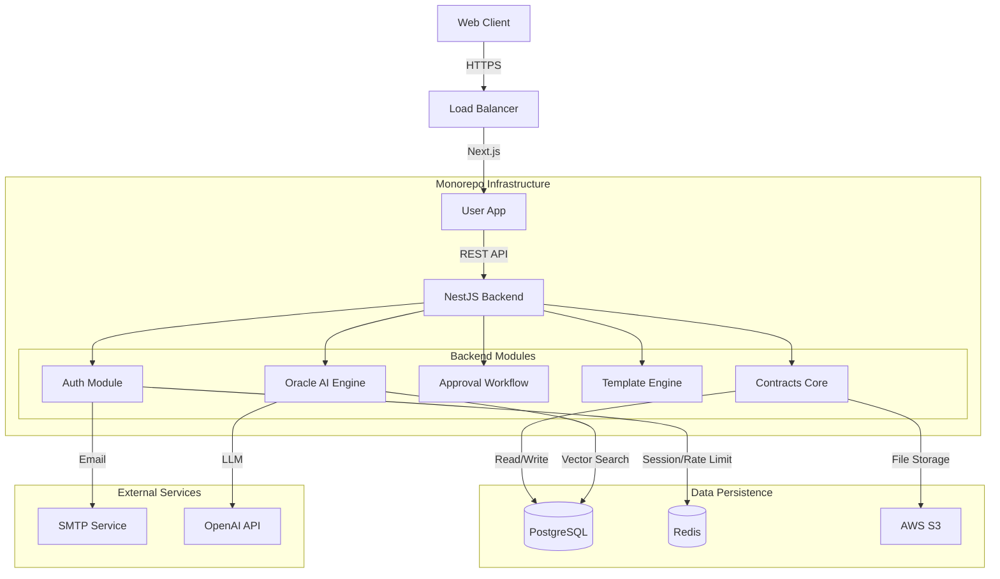

# CLM Enterprise - System Architecture

**Version:** 2.0.0
**Scope:** Enterprise Platform

## 1. High-Level Architecture

The platform follows a **Modular Monolith** architecture within a Turborepo monorepo, designed for scalability, type safety, and maintainability.

## 2. Technology Stack

### Frontend (`apps/user-app`)
-   **Framework**: Next.js 15 (App Router)
-   **Language**: TypeScript
-   **State**: TanStack Query (React Query)
-   **Styling**: Tailwind CSS
-   **UI Library**: Custom Design System (`packages/ui`)

### Backend (`apps/backend`)
-   **Framework**: NestJS 10
-   **Language**: TypeScript
-   **ORM**: Prisma (PostgreSQL 15)
-   **Validation**: `class-validator` + DTOs
-   **Documentation**: Swagger / OpenAPI

### Shared Packages (`packages/*`)
-   `@repo/types`: Shared interfaces between FE/BE.
-   `@repo/ui`: Reusable UI components.
-   `@repo/config`: Shared ESLint/TSConfig.

## 3. Core Modules

### 3.1 Authentication & Security
-   **Strategy**: JWT (Access Token + Rotating Refresh Token).
-   **Storage**: HttpOnly Cookies (Production) / LocalStorage (Dev fallback).
-   **RBAC**: Role-Based Access Control (Admin, User, Viewer) per Organization.
-   **Protection**: Helmet, CSRF, Rate Limiting (Redis-backed).

### 3.2 Contract Management
-   **Lifecycle**: Draft -> Approval -> Signature -> Active -> Expired.
-   **Versioning**: Full audit trail of changes.
-   **Storage**: Metadata in DB, Files in AWS S3 (Presigned URLs).

### 3.3 Oracle AI (RAG)
-   **Purpose**: Semantic Search & Contract Analysis.
-   **Tech**: `pgvector` for similarity search, OpenAI for generation.
-   **Privacy**: Zero-retention policy on inputs.

## 4. Infrastructure

| Component | Service | Usage |
|-----------|---------|-------|
| **Database** | PostgreSQL 15 | Primary relational data + Vector store. |
| **Cache** | Redis 7 | Session store, Rate limiting, BullMQ jobs. |
| **Object Store** | AWS S3 | Encrypted contract PDF storage. |
| **Email** | SMTP/SES | Transactional emails (Approvals, Invites). |
| **Hosting** | Vercel (FE) + AWS (BE) | Hybrid deployment model. |

## 5. Deployment Strategy
-   **CI/CD**: GitHub Actions.
-   **Docker**: Multi-stage build for backend optimization.
-   **Migrations**: Run via `prisma migrate deploy` on deployment.
-   **Health Checks**: `/health/live` and `/health/ready` endpoints.
